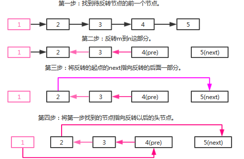
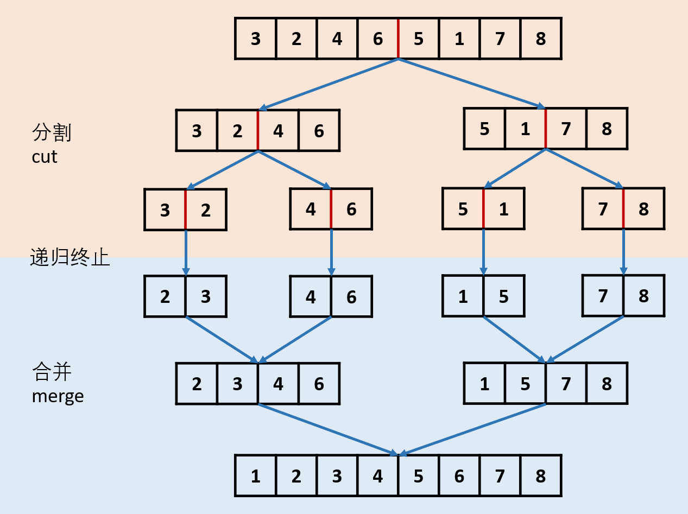
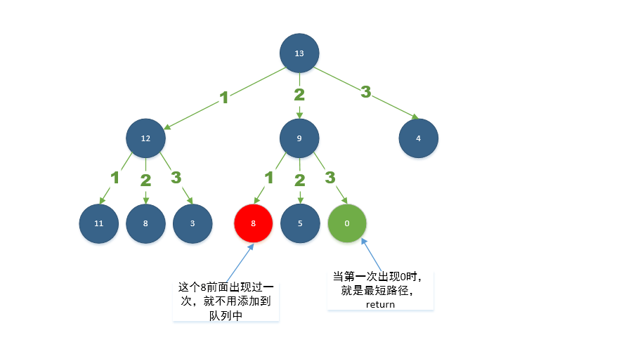

# 主要是关于算法方面的一些题目练习
## 1、数组相关题目：
- 力扣网：26、27、75、88、215、283：循环不变量，明确变量
- 力扣网：11、125、167、345：双指针碰撞
- 力扣网：3、76、209、438：滑动窗口，其中76题为438题的升华版。
    1. 滑动窗口的左指针和右指针在什么情况下滑动，一般判断右指针滑动，else就滑动左指针
    2. 右指针的判断，一般在右指针滑动到最右端的基础情况下，再做其他判断
    3. 要判断滑动终止的条件，一般是判断左指针不再可以移动了。
    4. 一般在滑动过后，要判断本窗口是否符合以满足的条件
    5. 3题判断最长不重复子串，重点是声明一个记录ASCII码的频率数组，通过右指针不断滑动更新频率数组，判断数组元素是否等于0来判断子串的字符是否重复
    6. 438题在3题的基础之上，寻找异位词子串的索引，除了声明了频率数组外，还引入了固定的滑动窗口，但之前需要扩展窗口至固定值，同时还引入了如何通过频率数组判断一个字符串是否重复
    7. 76题在438题的基础之上，寻找包含字符串的最小子串，多了点最小长度的判断
## 2、集合Set与Map相关操作
- 力扣网：202、242题、349题、350题
    - 349题和350题分别通过 Set 和 Map 求两个集合的交集
    - 242题:判断两个字符串出现字符频率一样，可使用map，也可使用数组记录频率，需分别遍历两个字符串
    - 使用集合来记录频率的题，一般都是使用一个集合去记录某个输入参数的频率，再去遍历另外一个输入参数判断，将判断对的结果放入新的集合中去
    - 205题和290题：判断两个字符串是否为同构的，两种解法：1、分别判断两个字符串中每个字符第一次出现的频率；2、将每个字符串的每个字符都翻译一遍，判断翻译后的是否相等
    - 1题（求两数之和）、15题（三数之和）、18题（四数之和）、16题（三数之和最接近目标值的）；求两数之和可以利用map记录值和索引，一边遍历一边去map中获取另一半，巧妙的运用了map的查找功能。求三数之和和四数之和本质上是在排序之后利用了双指针碰撞的原理，在一个或两个for循环的前提下进行双指针碰撞。
    - 219题和220题，在一个数组中查找两个符合（索引、两个值之差）特定规定的元素，可以使用Map或者Set来存储元素，同时使用滑动窗口去判断
## 3、链表相关的题目：双指针，虚拟头结点
- 206题：链表翻转，只需要定义三个节点，当前节点和当前节点需要指向的前一个节点，当前节点下一个移动节点。
- 92题在206题反转的基础之上加入了范围内的反转，思路如下：
- 83题：有序链表去重，只要依次遍历链表即可
- 86/328题：将一个链表按要求分割成两部分（数值大的在前小的在后...)，都是通过双指针技术，用一个指针指向下个节点应该插入的位置，另外一个指针去遍历并寻找下一个需要挪动位置的节点
- 2/445题：2题是两个数倒过来后相加，只需要依次将链表的每个节点相加，大于10就进1；445题是两个数相加，则先需要将两个数分别放入栈中，再取出来，就可以像2题一样解了。
- 203题（简单）：删除链表中给定值的节点
- 82题：83题的升级版，在有序列表中，只要重复了的元素就全部删除，我任然是利用两个指针去判断的。
- 21题：归并排序两个列表，思路和归并排序是一样的。
- 24题：在链表中两个两个节点的翻转。至少定义了3个节点，定义翻转前的节点和待翻转的几个节点。
- 25题：24题的升级版，n个节点进行翻转。两种解法，我自己的解法沿用了24题的解法，只是在那之上进行了方法封装。解法二利用递归，我感觉太他妈聪明了。
- 147题：插入排序的方法排序链表，主要有两个循环，第一个循环去查找待移动的元素，第二个内部循环去查找待插入的位置。
- 148题：归并排序的方法排序列表，主要使用递归的方法。
- 237题：删除链表中给定的某个节点。用下一个节点覆盖当前删除节点，从而转而删除下一个节点
- 19题：删除链表中倒数第n个节点。用间隔为n+1的双指针遍历找到删除节点的前一个节点
- 61题：翻转链表最后k个节点，思路跟19题差不多
- 143题：将链表的前面和后面节点交叉排列形成新的链表，链表平分为两个链表，再将后面的链表翻转一次，最后合并两个链表即可
- 234题：判断链表是否为回文链表，首先分割链表成两个，再反转后面的链表，再判断两个链表的每个值是否相等
## 4、栈和队列
   **栈顶元素反映了在嵌套的层次关系中，最近的需要匹配的元素** 
 - 20题：利用栈判断括号匹配，遇到左括号就压入栈中，遇到右括号就弹出栈中并判断。
 - 150题：计算逆波兰表达式的结果。将数字插入栈中，遇到符号弹出栈顶的两个数字，计算后返回到栈中。
 - 71题：优化Linux路径问题。可以用栈实现，但是我用StringBuilder就直接实现了。
 - 144题：二叉树的先序遍历
 - 94题：二叉树的中序遍历
 - 145题：二叉树的后序遍历
 - 341题：为复合的列表设计一个迭代器，用递归很好实现。
 - 102/107题：二叉树的层序遍历和二叉树层序遍历的倒叙。
 - 103题：二叉树的锯齿形层序遍历，只需要在上面的基础之上加上一个标识位即可。
 - 199题：保存树最右边的元素，利用层序遍历，只保存每一层的最右边的元素。
 > 树的层序遍历实际上就是广度优先遍历，当广度优先遍历应用在图上时，就是最短路径
 - 279题：将某个数分解成完全平方数的和。利用广度优先遍历找到该节点到0的最短路径。
 - 127题：词语接龙，从一个字符串链表中，没两个字符只能相差一个字，从而找到给定的首位两个单词相连的长度。这题也是广度遍历。
 - 126题：跟上一个题一样，但它要记录长度最小的结果集。没搞出来，就搞出来了个超时的。==*==